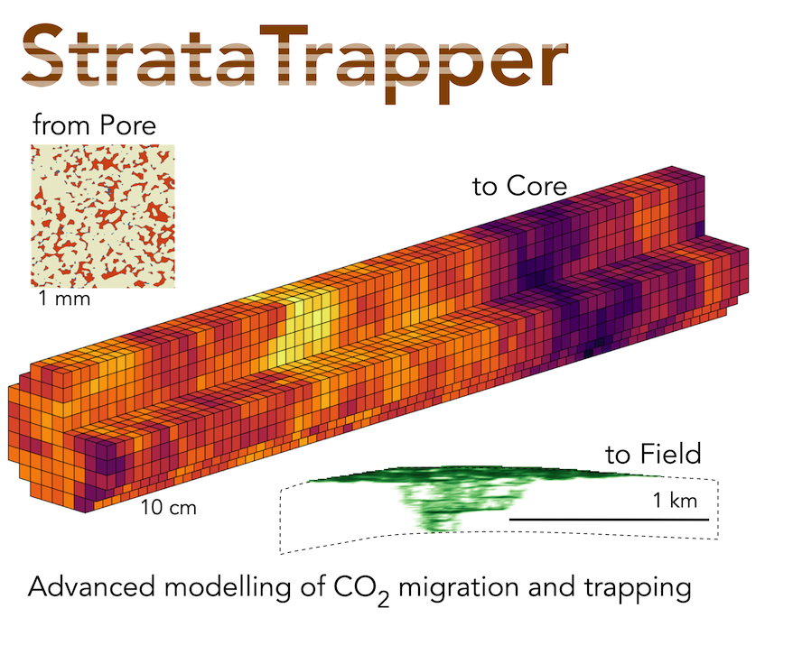

# Field scale model generation and upscaling [toolkit](https://github.com/ImperialCollegeLondon/StrataTrapper)

* [What is StrataTrapper upscaling toolkit?](#what-is-stratatrapper-upscaling-toolkit)
* [Structure](#structure)
* [Running](#running)
* [Versions](#versions)
* [Contributing](#contributing)
* [References](#references)

## What is StrataTrapper upscaling toolkit?

This is a tool to generate heterogeneous fine-scale model with specific correlation lengths & update model for coarse two-phase flow simulation.

## Structure

Top-level scripts and functions are in the repository root, and the rest in in [`src/`](src) folder.

[`demo.m`](demo.m) script is an implementation of the running guideline below.\
Feel free to play with it and use as an example for your own scripts.

## Running

1. Run [`stratup.m`](startup.m) to setup MATLAB Path.
2. [optional] Start a parallel pool to run computations there.
3. Setup reservoir model properties and algorithm options in the same format as produced by
  [`gen_params`](src/gen_params.m) and [`gen_options`](src/gen_options.m) functions.
4. Create logical `mask` to filter out impermeable cells and/or define an arbitrary subset of cells to process.
5. Run [`strata_trapper`](strata_trapper.m) function with all those arguments optionally enabling a UI progress bar.
6. Export the outputs to [PFLOTRAN-OGS](https://docs.opengosim.com/)-compatible text files using [`ogs_export`](ogs_export.m) function.
7. Interact and visualise outputs the same way as in the demo script or any other way of your preference.

Tips:

* Usually, MATLAB runs `startup.m` scripts automatically if they are in a startup folder.
* The heaviest part of the algorithm is essentially parallel with no synchronisation.\
  So, using several parallel workers usually results in a proportional performance boost.

## Versions

The original version of the toolkit is [v0.1.0](https://github.com/ImperialCollegeLondon/StrataTrapper/tree/v0.1.0).\
It has its own structure and some unique functionality,\
so it may worth attention as much as later versions.

[CHANGELOG.md](CHANGELOG.md) describes the version history and key changes.

Other versions can be accessed via [tags](https://github.com/ImperialCollegeLondon/StrataTrapper/tags) and [releases](https://github.com/ImperialCollegeLondon/StrataTrapper/releases) sections of the repository.

## Contributing

Everyone is welcome to open [issues](https://github.com/ImperialCollegeLondon/StrataTrapper/issues) and [pull requests](https://github.com/ImperialCollegeLondon/StrataTrapper/pulls).

## References

The StrataTrapper algorithm as well as motivation and theory behind it are in the paper:

> Samuel J. Jackson, Samuel Krevor\
> **Small-Scale Capillary Heterogeneity Linked to Rapid Plume Migration During CO2 Storage**\
> *Geophysical Research Letters* | 2020\
> <https://doi.org/10.1029/2020GL088616>
