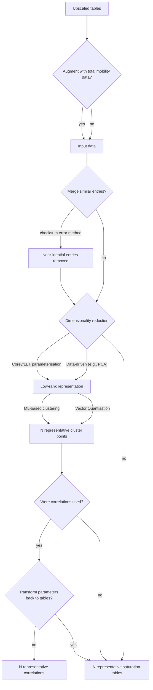
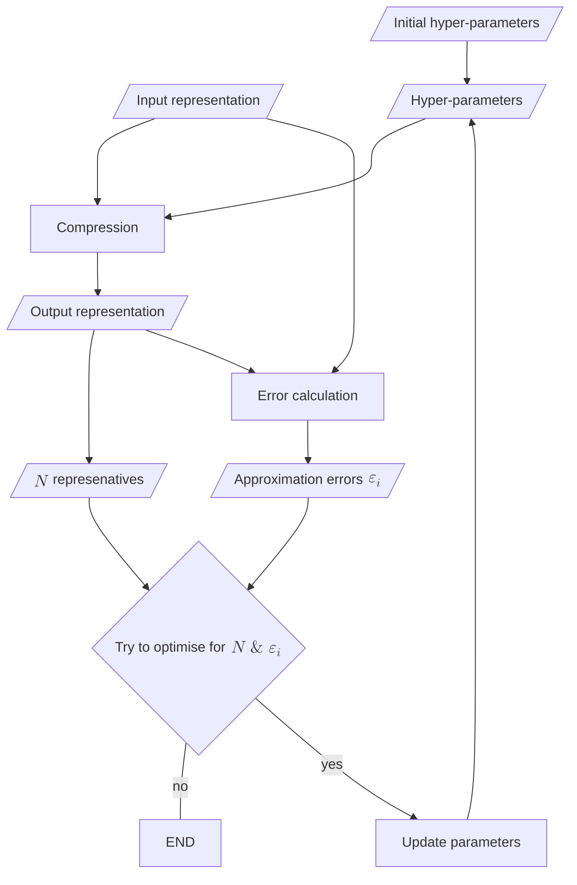

# Output compression feature concept

## Precautions

Do not edit this file. To write down additional notes and instructions, add another file at the same location as this one.

## Structure

### Inputs

This feature will be a function that will compresses the following upscaled tables of the `strata_trapper` function in case of a single param_id provided (only one input rock type):

- `strata_trapped.capillary_pressure`
- `strata_trapped.rel_perm_wat`
- `strata_trapped.rel_perm_gas`

The inputs should be provided separately.

### Location

The function should be located in `src/compress`. It should follow the style of this project.

### Outputs

The output of this function should be a struct with the same fields as the inputs. The difference is that the array dimensions that originally corresponded to `strata_trapped.idx` should now correspond to the resulting number of tables after the compression. An additional struct field should provide the mapping from `strata_trapped.idx` to indices of the compressed tables.

### Options

There will be optional arguments that should be implemented in the modern MATLAB name-value style with default values provided.

## Algorithm

The conceptual Mermaid flowchart for the algorithm:

### Error measurement

Each compression step (including final clustering) is lossy. Loss measurements: MSE of approximation (can be used during clustering).

The function should be complemented with an additional function that computes this difference between the inputs and the outputs of the compression function at every stage of the algorithm.

### Multi-objective compression optimisation

We aim for Pareto-optimal result with respect to minimal approximation error achieved with the smallest number of representatives.

## Implementation plan

1. You shoud start with a trivial function that only re-packs the inputs to the output format (almost a "no-op" function)
2. Then, implement the error measurement function, so I can make sure the approximation error at this step is zero.
3. Then, create a test function compatible with MATLAB test framework, so I can unit-test this feature using buildtool.
4. Then, the algorithm should be implemented gradually, step by step. Write down the plan to a separate file in the tmp folder and refer to it when working on each next step.
5. After all the work on this function alone is done, we will add support of this function.
    0. Separate compression for multple `param_id`s (multiple input rock types)
    1. Replacement of original `strata_trapper` outputs with the compressed one
    2. Support of the compressed outputs during visualisation and export.

- Every algorithm branch implementation should start with a simpler branch. Then another branch should be implemented along with the addition of an input flag for this branch.
- If an algorithm branch can only be reached in certain conditions, it should not be neccessary for a user to provide the corresponding option for the function.
- The default behaviour of the function, when no additional arguments are provided,simplest
- Reach for better maintenance and accessibility of implementation: avoid additional dependencies where possible.
- If I correct you and say to remember my corrections, write them down to files and keep in your context.
- Also, learn when to write down context notes without my explicit commands.

### Test iterations

After each logical step of the implementation process, I will swith to my MATLAB session to test your work. I will have my own test inputs in the framework, so

## Post scriptum

After all the work is done (when I say the work is finished), extract the transferrable best practices from our work experience on this feature and add them to the copilot instructions. This practice of adding best practices to the intstruction should also be added or updated in the instructions.
