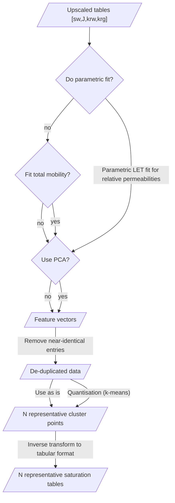

# Lossy compression of upscaled saturation tables

[Read more about Vector Quantization](https://en.wikipedia.org/wiki/Vector_quantization)

- [`quantize`](quantize.m) — main compression utility
- [`QuantizeOptions`](QuantizeOptions.m) — hyper-parameters
- [`dequantize`](dequantize.m) — restore compressed tables
to the original uncompressed number. Used for comparisons, plots, and export.
- [`compare_tables`](compare_tables.m) —
mean L2 difference between two alternative compressions
Can be used to compare with the original outputs.

## Algorithm

The conceptual Mermaid flowchart for the algorithm:

